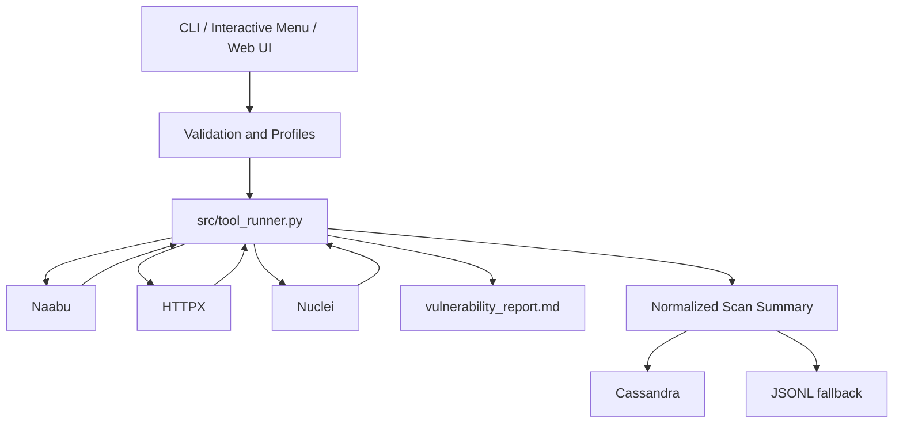

# Architecture

MTScan is an orchestration and reporting layer around external scanners. It is not a replacement scanner engine and is not an exploitation framework.

## Major components

### `src/tool_runner.py`

The shared execution layer. It owns target validation, scanner discovery, command construction, subprocess execution, output parsing, redaction, stage handoff, finding normalization, and report generation.

### `src/workflow.py`

The CLI adapter. It translates `argparse` options into the shared runner, performs preflight checks, chooses scanner modes, and persists completed scan summaries.

### `src/app_server.py`

A standard-library HTTP server that exposes the local authenticated dashboard API, scan jobs, recurring schedules, health information, and static web assets. It calls the shared runner directly rather than spawning the CLI.

### `src/scan_storage.py`

A storage abstraction for scan summaries, schedules, and authentication state. `auto` prefers Cassandra and falls back to local files.

### `mtscan.py`

The interactive launcher for web-app startup and management operations.

## Trust boundary

MTScan validates and constructs commands, but the actual network behavior of Naabu, HTTPX, Nuclei, and Nuclei templates is provided by external software. See [Security model](security-model.md).
